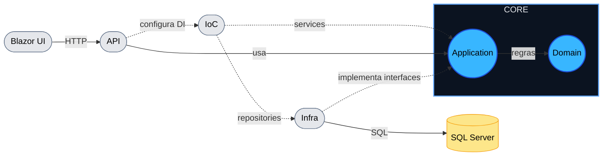

# Decisões de arquitetura

O projeto foi organizado em Clean Arch;

- `Domain`: entidades e regras de negócio.
- `Application`: services, interfaces e DTOs.
- `Infra.Data`: EF Core, repositórios, migrations, seeds e serviços técnicos de autenticação.
- `CrossCutting.IoC`: registro de dependências por responsabilidade.
- `Api`: controllers, Swagger, autenticação HTTP, autorização e middleware de erro.

A API atua como camada de entrada e invoca os services.
Os services orquestram a aplicação e aplicam regras do domínio.
A infraestrutura implementa interfaces definidas na Application, seguindo o princípio da inversão de dependência.
Assim, o Core não depende de nenhuma tecnologia externa.
