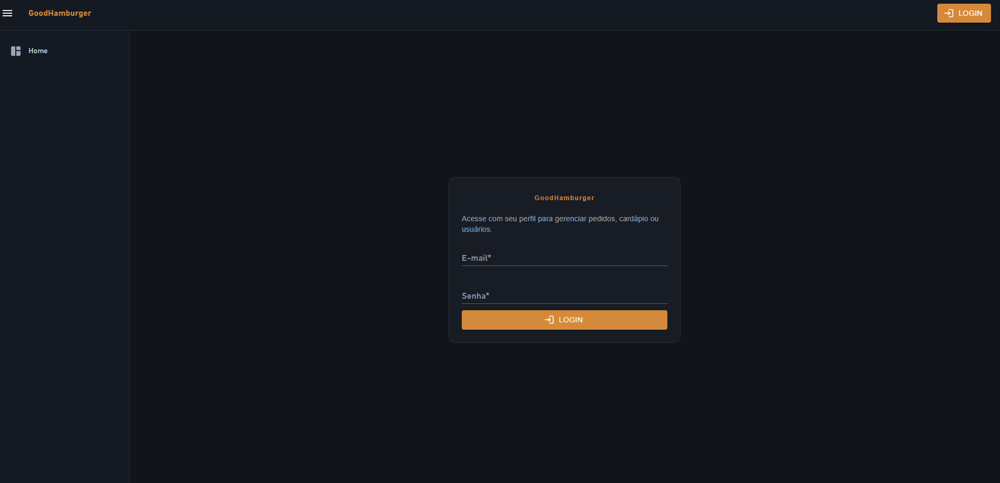
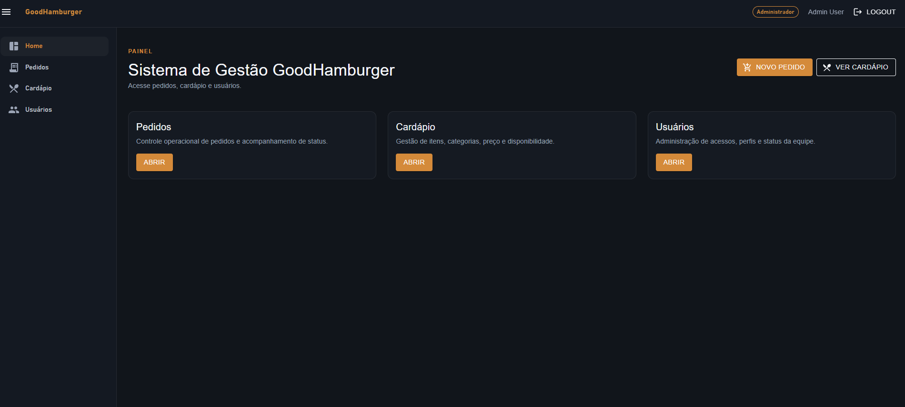
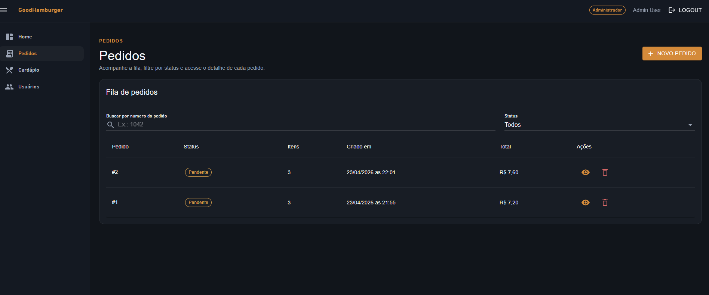
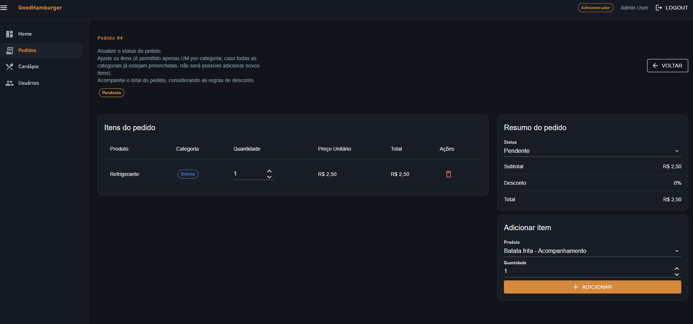
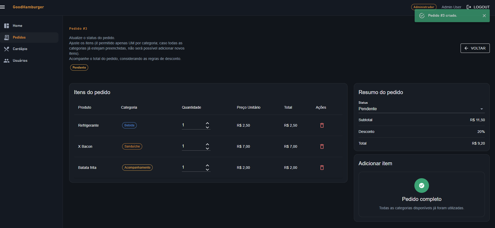
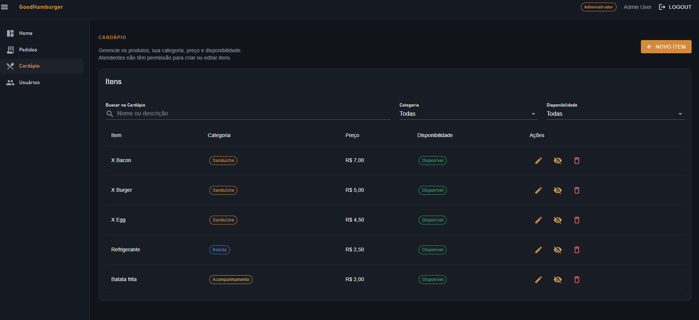
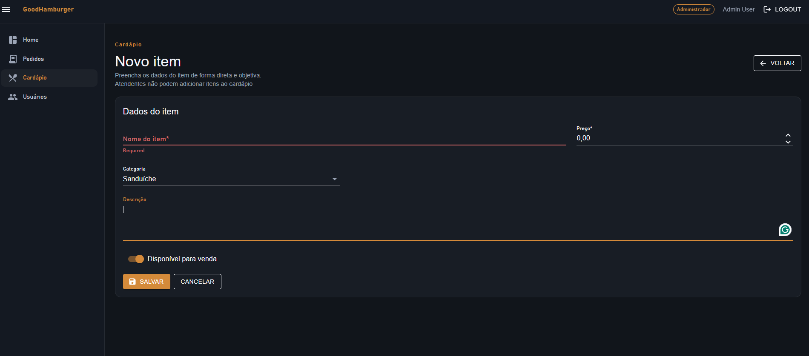
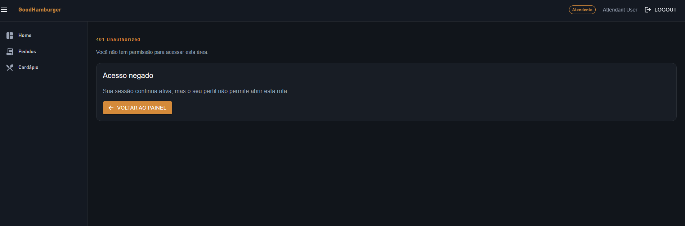

# UI Web (Blazor + MudBlazor)

O projeto `GoodHamburger.Web` implementa uma UI Blazor Server/Interactive Server consumindo a API REST por HTTP.

## Objetivo

- Login via `POST /api/v1/auth/login`.
- Consumo da API usando JWT no header `Authorization: Bearer`.
- Telas liberadas conforme a role retornada no login.
- UI simples, suficiente para demonstrar os fluxos principais do desafio.

## Arquitetura da UI

- A UI consome a API via HTTP e não chama `Application` diretamente.
- A sessão atual fica em memória no circuito Blazor.
- A UI esconde e exibe menus conforme a role do usuário.
- A segurança real permanece na API, por meio das policies de autorização.

## Perfis

- `Admin`: acessa pedidos, produtos e CRUD completo de usuários.
- `Manager`: acessa CRUD de pedidos, CRUD de produtos e cadastro de atendentes.
- `Attendant`: acessa CRUD de pedidos.

## Telas

### Login

- Autentica o usuário na API.
- Mantém a sessão em memória no circuito Blazor.
- Redireciona para o painel após sucesso.

### Home

### Pedidos

- Lista pedidos.
- Filtra por `OrderNumber`, não por `Guid`.

- Cria pedido com até um item por categoria.
- Visualiza detalhes do pedido.
- Adiciona item, altera quantidade, remove item, muda status e remove pedido.
-
-
-
### Produtos

- Disponível para `Admin` e `Manager`.
- Cria, lista, edita, ativa/inativa e remove produtos.
- Usa as categorias `Burger`, `Side` e `Drink`.
-
-
### Usuários

- `Admin`: cria, lista, edita e remove usuários.
- `Manager`: cadastra atendentes pela rota específica de attendants.
-

### Erro Unauthorized
-

## Observações

- A UI foi pensada para demonstrar os fluxos principais do desafio, sem adicionar complexidade desnecessária.
- Persistência de token, refresh token e fluxos mais avançados de autenticação ficaram fora do escopo.

